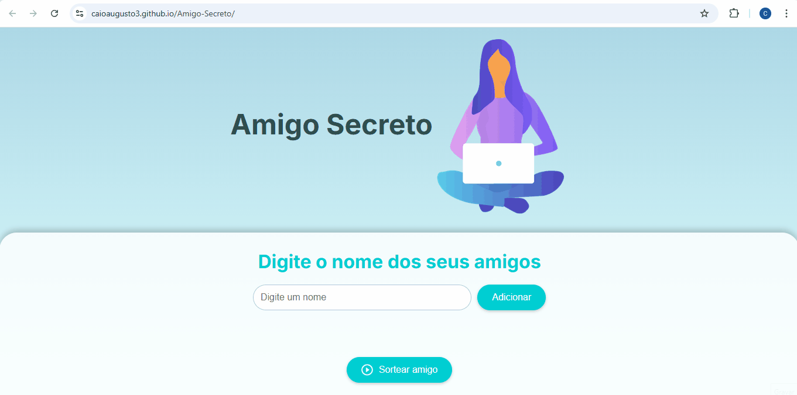

HTML
<h1 align="center">Sorteio Amigo Secreto 🎁</h1>

  O <strong>Sorteio Amigo Secreto</strong> é uma aplicação web prática e interativa desenvolvida para automatizar e simplificar a organização do tradicional Amigo Secreto, eliminando a necessidade de métodos manuais em papel.

  

  👉 <a href="https://caioaugusto3.github.io/Amigo-Secreto/" target="_blank"><strong>Clique aqui para testar a aplicação online</strong></a>

---

<h2>🎯 Objetivo do Projeto</h2>

O objetivo principal desta aplicação é resolver o problema comum de logísticas manuais no sorteio de Amigo Secreto (como perda de papéis, sorteio do próprio nome ou falhas na distribuição). A solução oferece uma interface simples, acessível e funcional onde o usuário pode:

<ul>
  <li><strong>Adicionar participantes:</strong> Insira os nomes dos amigos em uma lista dinâmica com validação de entradas.</li>
  <li><strong>Sorteio transparente:</strong> Realização do sorteio de forma totalmente aleatória com apenas um clique.</li>
  <li><strong>Visualização clara:</strong> Exibição do resultado de maneira instantânea e organizada na tela.</li>
</ul>

<h2>🛠️ Tecnologias Utilizadas</h2>
<ul>
  <li><strong>HTML5:</strong> Estruturação semântica e acessível da página.</li>
  <li><strong>CSS3:</strong> Estilização visual, layout e design responsivo.</li>
  <li><strong>JavaScript (Vanilla):</strong> Lógica de sorteio aleatório, manipulação de vetores (arrays) e interatividade com o DOM.</li>
</ul>

<h2>🧠 O que foi Aprendido</h2>

Durante a elaboração do projeto, foram consolidados os seguintes aprendizados técnicos e práticos:

<ul>
  <li><strong>Lógica de Programação:</strong> Aplicação de algoritmos de aleatoriedade (<code>Math.random</code> e <code>Math.floor</code>) e validações de fluxo.</li>
  <li><strong>Manipulação do DOM:</strong> Captação de eventos e inserção dinâmica de elementos na interface.</li>
  <li><strong>Foco em UX:</strong> Desenvolvimento focado em usabilidade simples e intuitiva para qualquer dispositivo.</li>
  <li><strong>Boas Práticas:</strong> Aplicação do conhecimento adquirido no programa <strong>Oracle Next Education (ONE)</strong> em parceria com a <strong>Alura</strong>.</li>
</ul>

<h2>🎨 Créditos e Agradecimentos</h2>
<ul>
  <li><strong>Ilustrações:</strong> Criadas por <strong>IRA Design</strong>.</li>
  <li><strong>Formação:</strong> Agradecimento especial à <strong>Alura</strong> e <strong>Oracle</strong> pelo suporte e conteúdo técnico.</li>
</ul>

<h2>👤 Autor</h2>

Desenvolvido por <strong>Caio Augusto</strong>.

