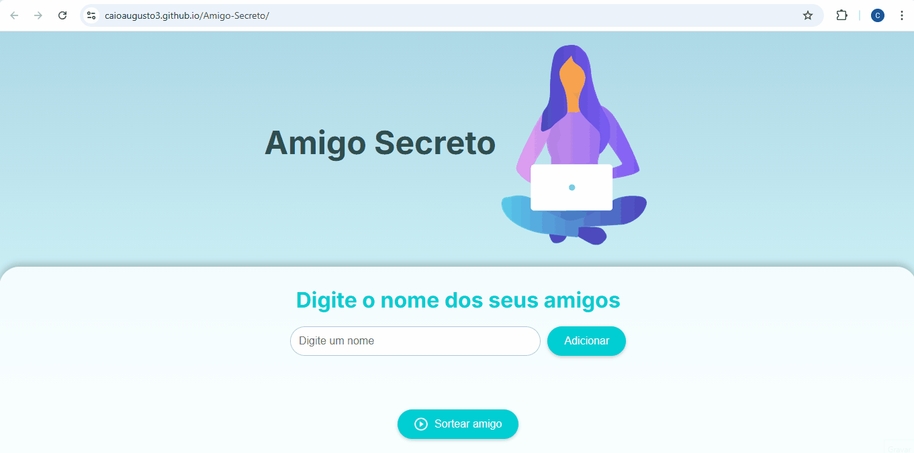

<h1 align="center">Sorteio Amigo Secreto</h1>

  O <strong>Sorteio Amigo Secreto</strong> é uma aplicação interativa que permite organizar e sortear aleatoriamente nomes para o tradicional Amigo Secreto. Com uma interface simples e funcional, você pode adicionar participantes, realizar o sorteio e visualizar o resultado de forma dinâmica.

<h2>Tecnologias Utilizadas</h2>
<ul>
  <li><strong>HTML</strong>: Estruturação da página.</li>
  <li><strong>CSS</strong>: Estilização e design responsivo.</li>
  <li><strong>JavaScript</strong>: Lógica de sorteio e interatividade.</li>
</ul>

<h2>Sobre o Projeto</h2>

O projeto foi desenvolvido para facilitar a organização de um Amigo Secreto, eliminando a necessidade de métodos manuais como papel e caneta. Com ele, é possível:

<ul>
  <li>Adicionar participantes à lista.</li>
  <li>Realizar o sorteio de forma aleatória.</li>
  <li>Visualizar os resultados de maneira clara e organizada.</li>
</ul>

<h2>Funcionalidades Principais</h2>
<ul>
  <li><strong>Adicionar</strong>: Insira os nomes dos amigos que participarão do sorteio aleatório.</li>
  <li><strong>Sortear amigo</strong>: O sistema realiza o sorteio aleatório e exibe o nome sorteado.</li>
</ul>

<h2>Acesso ao Projeto</h2>

Você pode acessar e utilizar o projeto online através do link abaixo:

<a href="https://caioaugusto3.github.io/Amigo-Secreto/">Sorteio Amigo Secreto</a>

<h2>Créditos e Agradecimentos</h2>
<ul>
  <li><strong>Imagens</strong>: A ilustração utilizada neste projeto foi criada por <strong>IRA Design</strong>.</li>
  <li><strong>Alura e Oracle</strong>: Agradeço à Alura e à Oracle pelo suporte e conhecimento compartilhado por meio do programa <strong>Oracle Next Education</strong>.</li>
</ul>

<h2>Autor</h2>
<ul>
  <li><strong>Caio Augusto</strong></li>
</ul>
